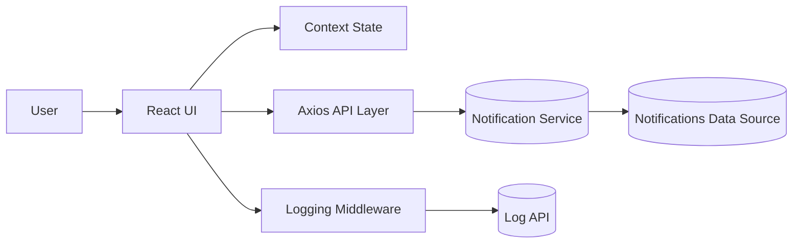
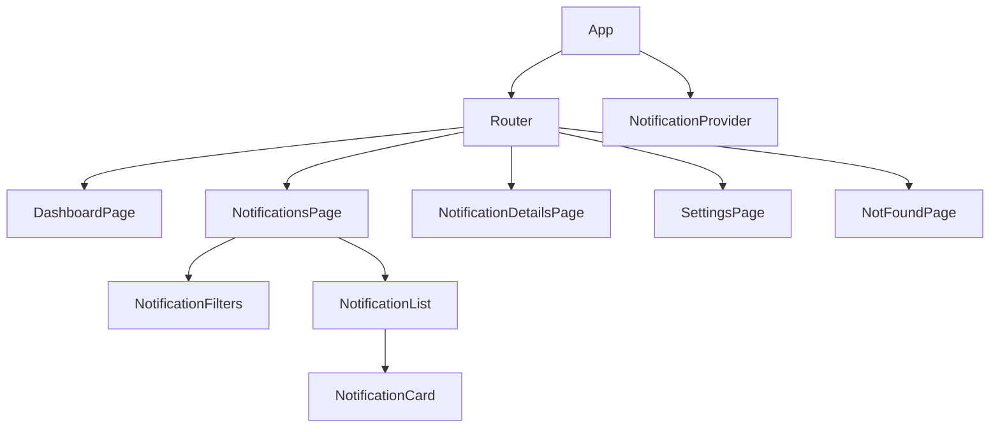

# Notification System Design

## Approach

The application processes campus notifications in TypeScript and keeps only unread items in the ranking pipeline. The top N list is maintained with a bounded selection strategy so the system can handle continuous incoming notifications without sorting the entire collection on every update.

## Ranking Strategy

1. Placement notifications outrank Result notifications.
2. Result notifications outrank Event notifications.
3. Within the same type, newer notifications rank higher.
4. Read notifications are excluded.

## Handling Incoming Notifications

Incoming notifications are validated, filtered by unread status, scored by notification type, and inserted into the bounded ranking set. If the collection grows beyond N, the lowest-ranked item is removed immediately.

## Scalability

The algorithm keeps a bounded working set, so space usage remains proportional to N rather than to the total stream size. This supports real-time updates and large notification volumes.

## Complexity

- Time complexity: O(m log N) for m processed notifications.
- Space complexity: O(N).

## Screenshot Checklist

1. Desktop dashboard screenshot.
2. Mobile dashboard screenshot.
3. Notifications page screenshot.
4. Priority notifications screenshot.
5. Error state screenshot.
6. Loading state screenshot.# Notification System Design

## 1. System Overview

The frontend is a React + TypeScript notification management dashboard that lets users review, search, filter, update, and delete notifications. A reusable logging middleware captures operational events without blocking the user experience.

## 2. Architecture Diagram

## 3. Component Diagram

## 4. Data Flow

1. The app loads notification data through the Axios service.
2. Context stores notifications, loading state, and error state.
3. UI components render filtered results from the context.
4. User actions update local state and persist to the API or mock data store.
5. Important actions are logged through the middleware.

## 5. Notification Flow

1. Dashboard loads summary counts and recent notifications.
2. Notifications page fetches the list and allows search and filtering.
3. Details page shows metadata, content, and current status.
4. Read, mark-all-read, and delete actions update both UI state and backend state.

## 6. API Layer Design

- Axios instance centralizes base URL, headers, and interceptors.
- Request interceptor attaches auth context and emits debug logs.
- Response interceptor normalizes successful responses and errors.
- Error handling converts transport failures into UI-safe messages.

## 7. State Management Design

- React Context stores notifications and global loading/error state.
- Derived selectors handle unread counts, search, filter, and pagination.
- Local form state handles settings and validation.

## 8. Scalability Considerations

- Separate API, hooks, pages, components, and utilities for maintainability.
- Mock-backed local storage fallback allows development without backend access.
- Context can be replaced later without changing page contracts.

## 9. Error Handling Strategy

- Every async action uses try/catch.
- User-facing errors are shown through inline error states and toast notifications.
- Logging failures never propagate to the UI.

## 10. Logging Strategy

- Logs are emitted for page loads, component renders, cache misses, API failures, and state transitions.
- The middleware validates stack, level, package, and message before sending.
- Logging uses bearer authentication and timeouts so failures degrade safely.

## 11. Security Considerations

- Bearer token is read from environment configuration.
- Input validation prevents malformed requests.
- The logging middleware never exposes secrets in UI state.
- API wrappers avoid unsafe HTML rendering.